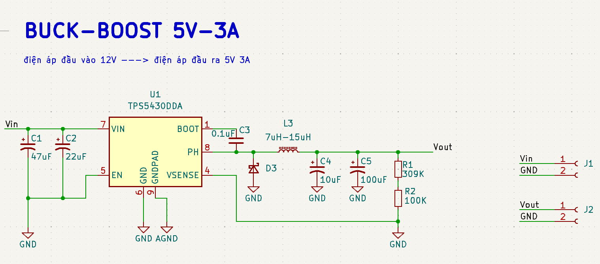
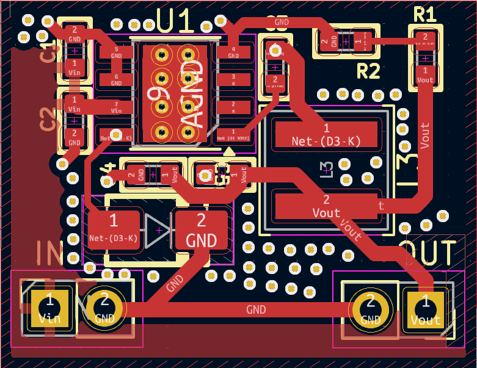
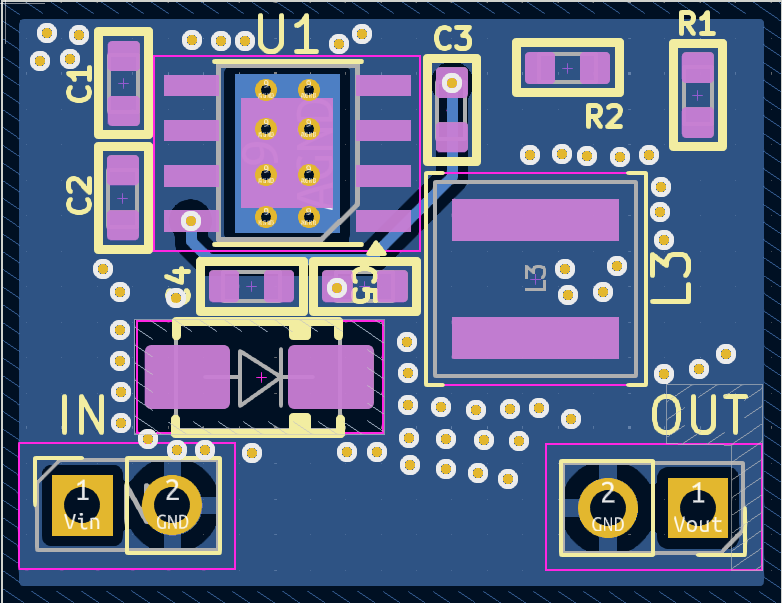
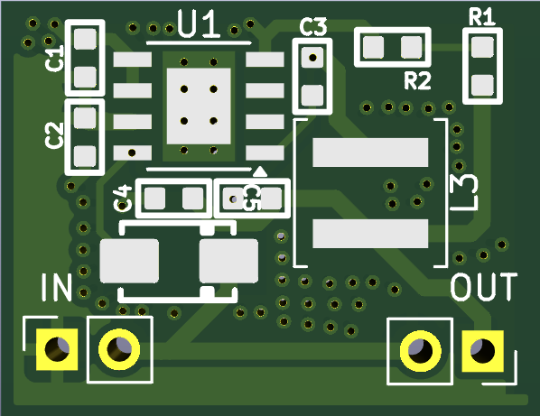
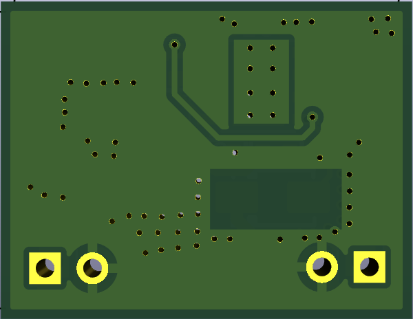

# TPS5430 12V → 5V 3A Buck Converter  
## 2-Layer Power PCB Design (EMI-Optimized)

---

## 🎯 Project Objective

Design and validate a manufacturable 2-layer PCB buck converter delivering:

- 12V input  
- Regulated 5V output  
- 3A continuous load  

Focus areas:

- Power loop optimization  
- EMI mitigation  
- Current density control  
- Manufacturability (DFM clean)  
- Ground return integrity  

This project demonstrates practical power PCB layout competency beyond schematic-level design.

---

# 📄 Schematic

  

Controller: TPS5430DDA (500 kHz, non-synchronous buck)

Key Components:

- 10 µH shielded inductor (≥4.5A Isat)
- SS54 Schottky diode
- 47µF + 22µF input capacitors
- 100µF + 10µF output capacitors
- Feedback: 309k / 100k → 5.0V output

---

# ⚙️ Power Design Calculations

### Inductor Ripple Current

For:

Vin = 12V  
Vout = 5V  
fSW = 500 kHz  
L = 10 µH  

Inductor ripple current:

ΔIL ≈ 0.58A  

Peak inductor current:

Ipeak ≈ 3.3A  

Inductor selected with ≥4.5A saturation current for margin.

---

### Output Voltage

TPS5430 reference voltage: 1.221V  

Using:

R1 = 309k  
R2 = 100k  

Vout ≈ 5.0V  

---

# 🔥 Power Stage Layout Strategy

## Hot Loop Control

  

The critical high di/dt loop:

VIN → SW → DIODE → CIN return  

Design actions:

- Loop area minimized
- SW trace length ≈ 3–4 mm
- Input capacitor placed adjacent to VIN and PGND
- PGND kept compact and low impedance

Reduced loop area → reduced parasitic inductance → lower radiated EMI.

---

## Bottom Ground Plane

  

- Continuous ground plane
- Short return paths
- Low impedance reference
- Improved thermal spreading

No signal traces routed under the SW node region.

---

# 📐 Current Density & Trace Width Justification

Target load: 3A DC  

Using IPC-2152 estimation (1 oz copper, 20°C rise):

Required width ≈ 1.0 mm  

Implemented width = 1.5 mm  

Benefits:

- Reduced voltage drop
- Lower copper temperature rise
- Better transient stability
- Improved reliability margin

---

# ⚡ EMI Mitigation Techniques

Switch node dv/dt and di/dt controlled by:

- Minimal SW copper area
- No routing under SW
- Tight input loop
- Shielded inductor selection
- Controlled ground return path

Increasing SW loop length significantly increases loop inductance and radiated EMI.

This layout prioritizes magnetic loop reduction over aesthetic symmetry.

---

# 🧩 3D Rendering

## Top View

  

## Bottom View

  

---

# 🛠️ DRC & Manufacturability

## DRC Validation

  

Final DRC status:

- No clearance violations
- Drill ≥ 0.30 mm
- Proper thermal relief
- Adequate copper spacing at switching node
- Gerber clean before fabrication

Designed for compatibility with standard fabrication services.

---

# 📊 Design Trade-offs

2-layer stackup chosen intentionally to:

- Demonstrate return path control without internal planes
- Control EMI using layout discipline rather than stackup advantage
- Maintain low manufacturing cost

4-layer version would improve:

- EMI suppression
- Controlled impedance
- Thermal performance

---

# 🧠 Engineering Competencies Demonstrated

- Buck converter power stage calculation  
- Loop inductance awareness  
- EMI-conscious routing  
- Ground strategy implementation  
- IPC-based current sizing  
- DRC-driven manufacturability validation  

---

# 🚀 Future Work

- Efficiency measurement validation  
- Load transient response testing  
- Thermal imaging analysis  
- Optional RC snubber optimization  
- 4-layer redesign comparison study  

---

# License

MIT License